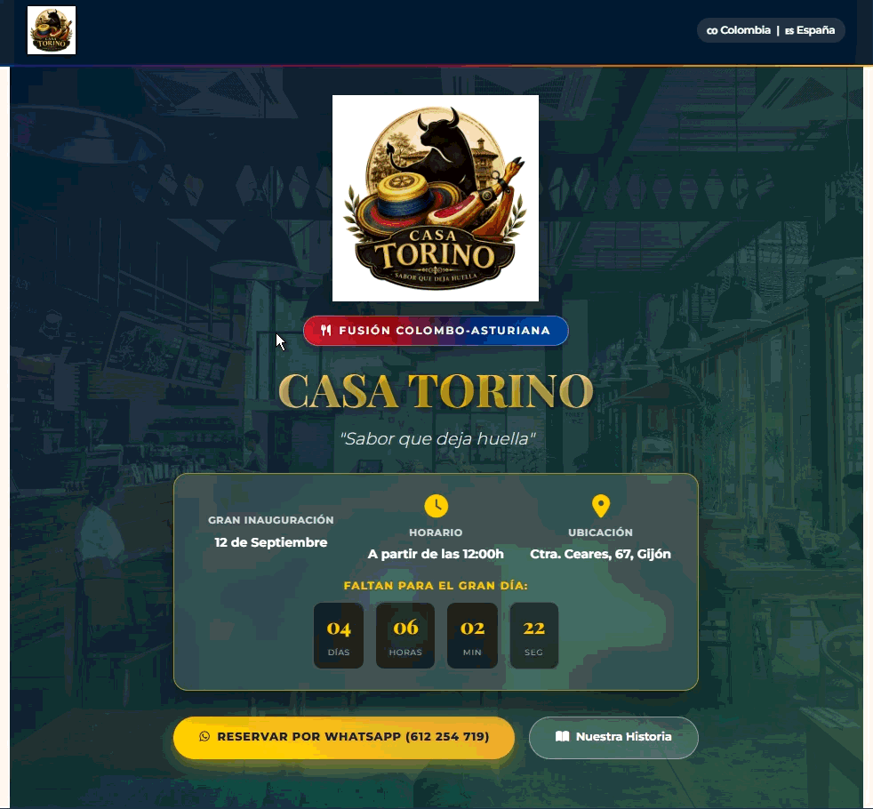
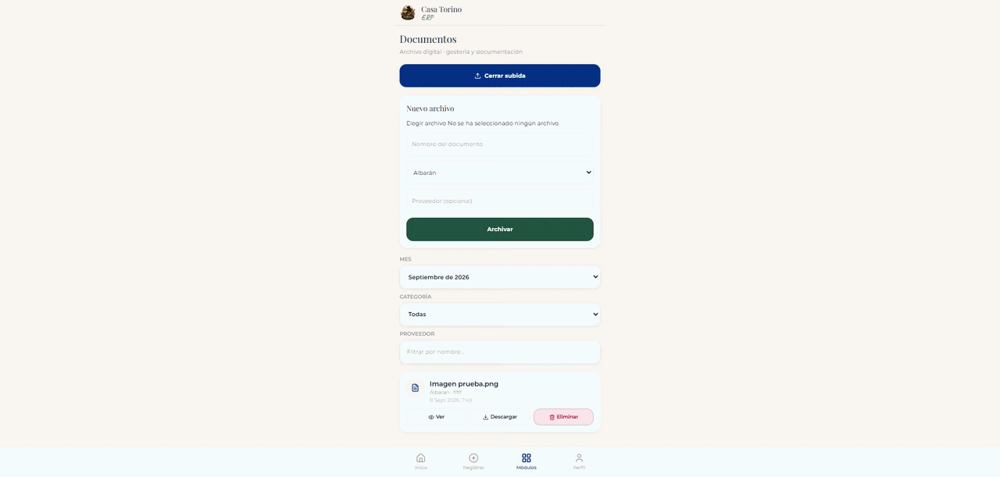

# Casa Torino App — Ecosistema digital del negocio familiar

> **Un solo proyecto · Web + ERP + Reservas**  
> Bar-restaurante familiar de fusión **Colombo-Asturiana** en Gijón (`Ctra. Ceares, 67`).

[](https://github.com/Sebastian-Tamayo/CasaTorinoApp)
[](https://casatorino.netlify.app)
[](https://reservas-casatorino.vercel.app)
[](#módulos-del-ecosistema)

Este repositorio **unifica** lo que antes estaba repartido en varios sitios:

| Antes (separado) | Ahora (aquí) |
|------------------|--------------|
| `casa-torino-web` | [`web/`](web/) |
| ERP / back-office (`CasaTorinoApp`) | [`erp/`](erp/) |
| App de reservas (en `Proyeccion`) | [`reservas/`](reservas/) |

Forman **el mismo negocio**: la web atrae, el ERP controla la operativa y las reservas gestionan la sala.

---

## Visión del ecosistema

```text
                         CLIENTES
                            │
                            ▼
              ┌─────────────────────────┐
              │  web/  · Marca pública  │  Historia, fusión, inauguración
              │  casatorino.netlify.app │  Contacto / WhatsApp
              └────────────┬────────────┘
                           │ demanda / canal
                           ▼
              ┌─────────────────────────┐
              │  reservas/ · Sala       │  Alta rápida, edición, estados
              │  reservas-casatorino…   │  4 personas del equipo + PIN
              └────────────┬────────────┘
                           │ ocupación / servicio
                           ▼
              ┌─────────────────────────┐
              │  erp/ · Back-office     │  Gastos, ingresos, fiscal,
              │  Next.js + Supabase     │  RRHH, documentos, proveedores
              └─────────────────────────┘
```

**Para reclutadores:** no son tres demos sueltas. Es un **producto conjunto** de un negocio familiar real: front de marca + operativa de sala + ERP mobile-first.

---

## Módulos del ecosistema

### 1. [`web/`](web/) — Página pública
Landing HTML/CSS/JS hecha a mano para la marca Casa Torino.  
**Live:** https://casatorino.netlify.app  



### 2. [`reservas/`](reservas/) — Gestión de mesas (personal)
App React + TypeScript + Vite + API serverless en Vercel.  
Uso interno del equipo (Lorena, Yuli, Dayana, Claribel — PIN demo `1234`).  
**Live:** https://reservas-casatorino.vercel.app  

### 3. [`erp/`](erp/) — ERP / back-office de hostelería
Next.js 15 + Supabase (PostgreSQL, Storage, RLS) + Tailwind.  
Gastos, ingresos, P&L, fiscal trimestral, RRHH, documentos y proveedores.



| Pantalla | Captura |
|----------|---------|
| Dashboard |  |
| Documentos |  |
| Más vistas | [`docs/media/erp/`](docs/media/erp/) (`Captura3`–`Captura5`, GIFs) |

---

## Estructura del monorepo

```text
CasaTorinoApp/
├── README.md                 ← este documento (visión conjunta)
├── docs/
│   ├── ECOSISTEMA.md         ← mapa de negocio y deploys
│   └── media/                ← capturas y vídeos/GIF conservados
│       ├── erp/
│       ├── web/
│       └── reservas/
├── web/                      ← landing pública
├── reservas/                 ← app de reservas (staff)
└── erp/                      ← ERP Next.js + Supabase
```

Todas las **capturas y demos animadas** del ERP y de la web están guardadas en `docs/media/` para que no se pierdan al unificar repos.

---

## Cómo arrancar en local

### Web
```bash
cd web
# abrir index.html en el navegador, o:
npx serve .
```

### Reservas
```bash
cd reservas
npm install
npm run dev
```

### ERP
```bash
cd erp
cp .env.example .env.local   # completar URL y anon key de Supabase
npm install
npm run dev
```

Detalle de cada módulo: sus propios `README.md`.

---

## Deploys

| Módulo | Hosting | URL |
|--------|---------|-----|
| Web | Netlify | https://casatorino.netlify.app |
| Reservas | Vercel | https://reservas-casatorino.vercel.app |
| ERP | Vercel + Supabase | (proyecto Next en `erp/`) |

---

## Autor

**Sebastián Olaya Tamayo** — [@Sebastian-Tamayo](https://github.com/Sebastian-Tamayo)

Proyecto de portfolio y uso real del negocio familiar **Casa Torino** (Gijón).
