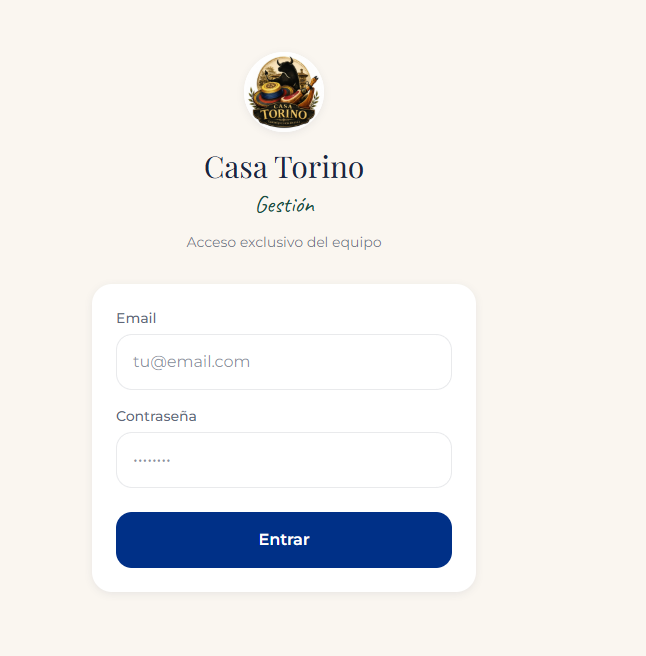

> Módulo **ERP** del monorepo [CasaTorinoApp](https://github.com/Sebastian-Tamayo/CasaTorinoApp) (web + reservas + ERP).


# 🍷 Casa Torino - Hospitality ERP & Management Back-Office


Aplicación web Fullstack concebida como un **ERP (Enterprise Resource Planning)** a medida para la gestión operativa, fiscal, laboral y documental de un negocio de hostelería. Diseñada bajo un enfoque **Mobile-First** para funcionar en tiempo real desde smartphones o tablets en el propio local.

---

## 💡 ¿Por qué es un ERP de Hostelería?

A diferencia de un simple contador de gastos, **Casa Torino** centraliza la gestión integral del restaurante/bar en un único sistema interconectado:

1. **Gestión Documental y Digitalización:** Archivo en la nube de facturas, albaranes y contratos escaneados mediante Supabase Storage.
2. **Recursos Humanos (RRHH):** Control de plantilla y automatización de costes laborales (salarios netos, IRPF y Seguridad Social).
3. **Fiscalidad (IVA e IRPF):** Desglose automático de bases imponibles, IVA soportado vs. repercutido y modelo trimestral ($Q1, Q2, Q3, Q4$).
4. **Control de Proveedores:** Trazabilidad de compras por distribuidor (alimentación, bebida, suministros) para análisis de coste de ventas.
5. **Cuenta de Resultados (P&L / EBITDA):** Balance en tiempo real que refleja el beneficio operativo neto del negocio.

---

## 🎥 Demostración en Video


---

## 🚀 Módulos y Funcionalidades

* **Balance General (P&L / EBITDA):**
  * Cálculo del beneficio neto: $\text{Ingresos (Base)} - \text{Coste Mercancía} - \text{Costes Laborales} = \text{EBITDA}$.
  * Cierres mensuales con selector de histórico.
* **Gestión Documental (Gestoría):**
  * Subida de facturas, tickets, albaranes y contratos (PDF/Imágenes).
  * Visor integrado y filtrado por categoría o proveedor.
  * Almacenamiento seguro en **Supabase Storage** (`documentos_adjuntos`).
* **Recursos Humanos (RRHH):**
  * Fichas de empleados con sueldos, Seguridad Social y retenciones IRPF.
  * Generación automática de gastos de nómina con un clic ("Liquidar Mes").
* **Módulo Fiscal Trimestral:**
  * Estimación del IVA a pagar/devolver por trimestres.
  * Acumulado de retenciones de IRPF para la declaración de la gestoría.
* **Analítica de Proveedores:**
  * Ranking mensual de compras por proveedor y volumen consumido.
* **Control de Caja y Entradas/Salidas:**
  * Registro unificado de ingresos (Local vs. Domicilio) y formas de pago (Tarjeta vs. Efectivo).
  * Eliminación individual de registros con confirmación en interfaz y RLS.

---

## 🏗️ Arquitectura y Stack Tecnológico

* **Frontend:** [Next.js 15 (App Router)](https://nextjs.org/) y React.
* **Estilos:** [Tailwind CSS](https://tailwindcss.com/) optimizado para dispositivos móviles y pantallas táctiles.
* **Backend & Storage:** [Supabase](https://supabase.com/) (PostgreSQL relacional + Supabase Storage).
* **Despliegue & CI/CD:** [Vercel](https://vercel.com/) conectado a la rama `main` de GitHub.

---

## 🗄️ Modelo de Datos (PostgreSQL en Supabase)

El sistema estructura la información a través de las siguientes tablas protegidas por **Row Level Security (RLS)**:

* **`gastos`:** Registro de compras y gastos operativos (importe, categoría, origen de fondos, proveedor, base imponible, % IVA).
* **`ingresos`:** Registro de ventas diarias (importe, canal local/domicilio, medio de pago tarjeta/efectivo, base imponible, % IVA).
* **`empleados`:** Ficha de trabajadores (puesto, salario bruto, coste Seguridad Social, % retención IRPF).
* **`nominas_pagadas`:** Histórico de nóminas liquidadas por mes y trabajador.
* **`documentos`:** Metadatos de archivos subidos (nombre, URL de Supabase Storage, categoría, proveedor asociado).
* **Bucket de Storage:** `documentos_adjuntos` (almacenamiento físico de PDF/JPG/PNG).

---

## 📸 Pantallas de la Aplicación



---

## 🛠️ Instalación y Configuración Local

1. **Clonar el repositorio:**
```bash
git clone [https://github.com/Sebastian-Tamayo/CasaTorinoApp.git](https://github.com/Sebastian-Tamayo/CasaTorinoApp.git)
```

2. **Instalar dependencias:**
```bash
npm install
```

3. **Variables de Entorno:**
Crea un archivo `.env.local` en la raíz con las credenciales de tu proyecto de Supabase:
```env
NEXT_PUBLIC_SUPABASE_URL=[https://tu-proyecto.supabase.co](https://tu-proyecto.supabase.co)
NEXT_PUBLIC_SUPABASE_ANON_KEY=tu-clave-anonima
```

4. **Servidor de Desarrollo:**
```bash
npm run dev
```

5. Abre `http://localhost:3000` en el navegador.

---

## 👨‍💻 Autor

Desarrollado por **Sebastián Tamayo**.

* **GitHub:** [@Sebastian-Tamayo](https://github.com/Sebastian-Tamayo)
